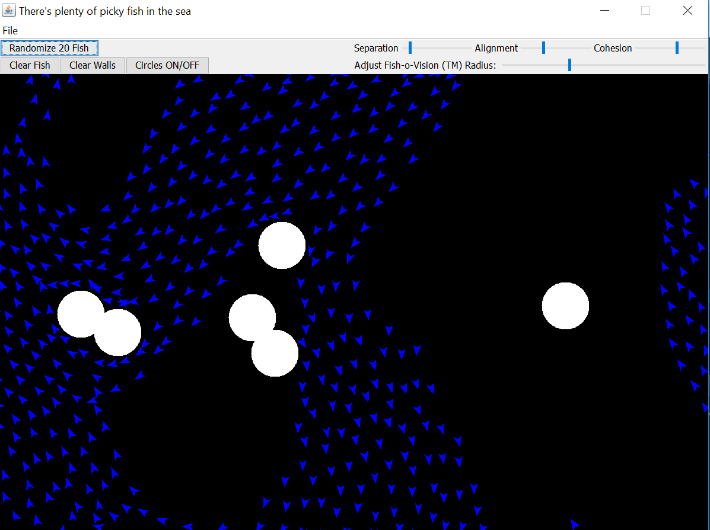

# boidsimulation

Simulation of flocking behaviour of fish in a 2d space. First year school project.

Fun little project with lot's of entertainment value for chilren of 4-6 years. This has been tested on the field.

Written in Scala.

