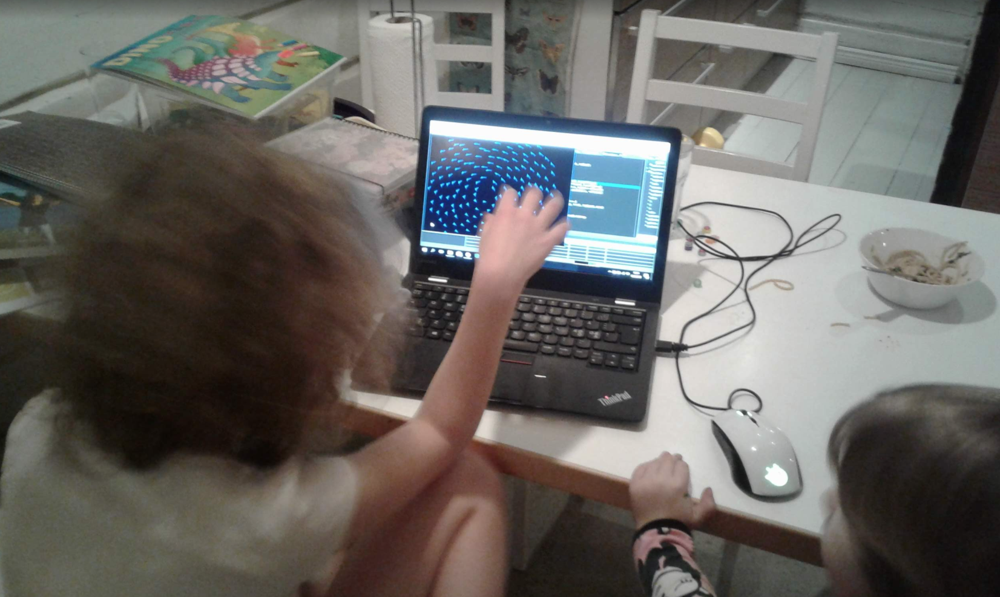

# Boid Simulation

Simulation of schooling behaviour of "fish" in a 2D space. A First year school project. The simulation is based on the idea of [Craig Reynolds](https://en.wikipedia.org/wiki/Craig_Reynolds_(computer_graphics))' boid simulation from 1986. To quote [Wikipedia](https://en.wikipedia.org/wiki/Boids):

>
> Boids is an example of emergent behavior; that is, the complexity of Boids arises from the interaction of individual agents (the boids, in this case)
> adhering to a set of simple rules. 
>

So why fish instead of boids (New York Metropolitan area dialect pronunciation for "birds")? No matter how I tweaked the simulation parameters I could not get
the boids to exhibit a behaviour which resembles that of starlings (something called [murmutation](https://www.youtube.com/watch?v=V4f_1_r80RY)). This is most likely
due to the fact that real birds can move in 3D space but my boids are restricted in their movement to 2D space. Therefore the collective behaviour that emerges from the simulation resembles more of fish living in shallow waters (effectively restricting their movement to 2 degrees of freedom) than birds.

TL;DR; Schooling simulation of fish. Fun little app with lot's of entertainment value for chilren of 4-6 years. 

Some critical screenshots:

